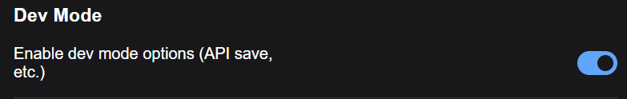

# ⛓️ Comfyui-FlowChain

## 💡 Description
This repository includes a set of custom nodes for ComfyUI that allow you to:

 - Convert your workflows into nodes
 - Chain your workflows together
 - Bonus: a node to integrate [LipSync Studio v0.6](https://www.patreon.com/Wav2LipStudio) via API (third-party application)


## 🚀 All Nodes


## 📖 Quick Index
* [🚀 Updates](#-updates)
* [🔗 requirements](#-requirements)
* [💻 Installation](#-installation)
* [🕸️ Nodes](#-nodes)
* [🐍 Usage](#-usage)
* [💪 Special things to know](#-special-things-to-know)
* [📺 Examples](#-examples)
* [😎 Contributing](#-contributing)
* [🙏 Appreciation](#-appreciation)
* [📜 License](#-license)
* [☕ Support](#-support)

## 🚀 Updates
**2024.11.01 Initial version features :**
- 💪 Convert your workflows into nodes
- ⛓️ Chain your workflow
- 👄 Extra Node that use [LipSync Studio v0.6](https://www.patreon.com/Wav2LipStudio)

## 🔗 requirements

- **comfyui**: Be sure to have a ComfyUI front-end version of at least 1.3.11. If not, update ComfyUI to the latest version. To find the front-end version, go to ComfyUI settings (the gear icon), click "About," and check the version at the top of the page.

## 💻 Installation

1. Install [Git](https://git-scm.com/)
2. Go to folder ..\ComfyUI\custom_nodes
3. Run cmd.exe
   > **Windows**:
   >
   > > **Variant 1:** In folder click panel current path and input **cmd** and press **Enter** on keyboard
   > >
   > > **Variant 2:** Press on keyboard Windows+R, and enter cmd.exe open window cmd, enter **cd /d your_path_to_custom_nodes**, **Enter** on keyboard
4. Then do : 

```git clone https://github.com/numz/Comfyui-FlowChain.git```

After this command be created folder Comfyui-FlowChain

8. Go to the folder: 

```cd Comfyui-FlowChain```

8. Then do:

```pip install -r requirements.txt```

7. Run Comfyui...

## 🕸️ Nodes:

|                                                   | Name                |                                                 Description                                                  | ComfyUI category |
|:-------------------------------------------------:|:--------------------|:------------------------------------------------------------------------------------------------------------:|:----------------:|
|  | _Workflow_          | Node that allows loading workflows in API format. It will show Inputs and Outputs into the loaded Workflows  |   FlowChain ⛓️   |
|     | _Workflow Input_    |                              Node used to declare the inputs of your workflows.                              |   FlowChain ⛓️   |
|    | _Workflow Output_   |                             Node used to declare the outputs of your workflows.                              |   FlowChain ⛓️   |
|  | _Workflow Continue_ |                                 Node to stop/Continue the workflow process.                                  |   FlowChain ⛓️   |
|   | _Workflow Lipsync_  |                                   Extra Node to use LipSync Studio via API                                   |   FlowChain ⛓️   |


# 🐍 Usage

## ⛓️ Workflow Node


 - Load a workflow in **workflows** list. This field will show all workflows saved in the comfyui user folder: **ComfyUI\user\default\workflows\api**, if you add a new workflow in this folder you have to refresh UI (F5 to refresh web page) to see it in the **workflows** list.
 - Workflows have to be saved as **API format** of comfyui, but save it also in normal format because "api formal file" can't be loaded in comfyui as usually.

 

If you don't see **"Export (API format)"** options in Comfyui do this :
 - go to Settings
 - Activate the **Dev Mode** options



-You can also Import the file by "copy/paste" your workflow path in "workflow_api_path" and click import, that will add your workflow in the comfyui api path.

## ⛓️ Input Node


- Allow to declare inputs in your workflow.
- Types available :  **"IMAGE", "MASK", "STRING", "INT", "FLOAT", "LATENT", "BOOLEAN", "CLIP", "CONDITIONING", "MODEL", "VAE"**
- Give a Name and select the type.
- **Default** value is used when debugging your workflow or if you don't plug an input into the **Workflow** node.

- 

## ⛓️ Output Node


- Allow to declare outputs in your workflow.
- Types available :  **"IMAGE", "MASK", "STRING", "INT", "FLOAT", "LATENT", "BOOLEAN", "CLIP", "CONDITIONING", "MODEL", "VAE"**
- Give a Name and select the type.
- **Default** value is used to connect the output.


## ⛓️ Continue Node


- Usually associated with a **boolean** input plugged on **"continue_workflow"**, allow to "Stop" a workflow if **"continue_workflow"** is False.
- Types available :  **"IMAGE", "LATENT"**
- Give a Name and select the type.
- During development of your workflow, If **continue_worflow" is False it will let pass only 1 image/latent, and if True it will let pass all images/latents.


- But When a workflow is loaded into the **"workflow"** Node, which contain a **"Workflow Continue"** node, it will be delete if **continue_workflow** is False. That allow to create conditional situation where you want to prevent computation of some parts.


## 🔉👄 Workflow LipSync Node


- Extra Node that allow to use third-party app **[Lipsync Studio v0.6](https://www.patreon.com/Wav2LipStudio)** Via it's API
- Inputs:
    - **frames**: Images to compute.
    - **audio**: Audio to add.
    - **faceswap_image**: An image with a face to swap.
    - **lipsync_studio_url**: usually http://127.0.0.1:7860
    - **project_name**: name of your project.
    - **face_id**: id of the face you want to lipsync and faceswap.
    - **fps**: frame per second.
    - **avatar**: Will be used create a driving video, 10 avatars are available, each give different output result.
    - **close mouth before Lip sync**: Allow to close the mouth before create the lip sync.
    - **quality**: Can be **Low, Medium, High**, in High gfpgan will be used to enhance quality output.
    - **skip_first_frame**: number of frames to remove at the beginning of the video.
    - **load_cap**: number of frames to load.
    - **low vram**: allow to decrease VRAM consumption for low pc configuration.

Project will be automatically created into your Lipsync Studio **projects** folder. You can then load it into studio and work directly from studio if the output not good enough for you.


## 💪 Special things to know

 the **"🪛 Switch"** nodes from [Crystools](https://github.com/crystian/ComfyUI-Crystools) have a particular place in **workflow Node**


Let's illustrate this with an example:


Here we want to choose between video1 or video2. It depends on the **boolean** value in **Switch Image Node**. The issue here is that both videos will be loaded before Switch. To prevent both videos from being loaded, the **"workflow node"** will check the boolean value, remove the unused node, and directly connect the correct value to the preview image.


This gives you the ability to create truly conditional cases in your workflows, without computing irrelevant nodes.

# 📺 Examples

Coming soon

# 😎 Contributing

We welcome contributions to this project. When submitting pull requests, please provide a detailed description of the changes. see [CONTRIBUTING](CONTRIBUTING.md) for more information.

# 🙏 Appreciation 
- [Jedrzej Kosinski](https://github.com/Kosinkadink/ComfyUI-VideoHelperSuite) : For the code quality that really inspired me during development.


# ☕ Support

this project is open-source effort that is free to use and modify. I rely on the support of users to keep this project going and help improve it. If you'd like to support me, you can make a donation on my [buy me a coffe](https://buymeacoffee.com/numzzz5) or [Patreon page](https://www.patreon.com/Wav2LipStudio). Any contribution, large or small, is greatly appreciated!

Your support helps me cover the costs of development and maintenance, and allows me to allocate more time and resources to enhancing this project. Thank you for your support!

[](https://buymeacoffee.com/numzzz5)

[patreon page](https://www.patreon.com/Wav2LipStudio)

# 📜 License
* The code in this repository is released under the MIT license as found in the [LICENSE file](LICENSE).
