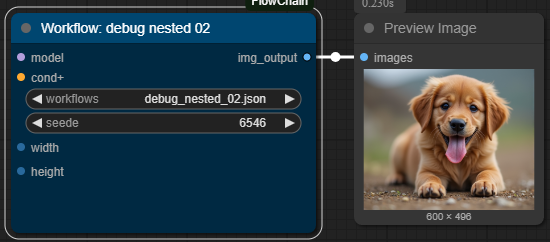

# ⛓️ Comfyui-FlowChain

## 💡 Description

This repository includes a set of custom nodes for ComfyUI that allow you to:

- Convert your workflows into nodes
- Chain your workflows together
- Bonus: a node to integrate [LipSync Studio v0.6](https://www.patreon.com/Wav2LipStudio) via API (third-party application)


## 🚀 All Nodes


## 📖 Quick Index

- [🤔 Why, when the 'convert to group node' option already exists?](#-why-when-the-convert-to-group-node-option-already-exists)
- [🚀 Updates](#-updates)
- [🔗 requirements](#-requirements)
- [💻 Installation](#-installation)
- [🕸️ Nodes](#-nodes)
- [🐍 Usage](#-usage)
- [📂 Export Nested Projects](#-Export-Nested-Projects)
- [💪 Special things to know](#-special-things-to-know)
- [📺 Examples](#-examples)
- [😎 Contributing](#-contributing)
- [🙏 Appreciation](#-appreciation)
- [📜 License](#-license)
- [☕ Support](#-support)

## 🤔 Why, when the 'convert to group node' option already exists?

The idea came from the frustration users experienced with the many limitations and bugs in ComfyUI’s group nodes. While group nodes can seem useful for organizing nodes hierarchically, their actual use often leads to issues. Here are some of the major flaws I aimed to address:

- **Instability with primitive nodes**: Primitive nodes are often dropped when grouped, making them ineffective in complex workflows.
- **Issues with dynamic nodes**: Dynamic nodes, such as those with switches or conditional behaviors, tend to lose connections when grouped.
- **Incompatibility with ControlNet**: When integrating ControlNet nodes into group nodes, the order of inputs and outputs is crucial to avoid reversing results.
- **Complex node maintenance**: Managing nodes in ComfyUI can quickly become overwhelming, especially when you need to modify the same function multiple times.

By solving these problems, my tool makes node management more intuitive, stable, and efficient, allowing you to focus on what matters: creating.

## 🚀 Updates

**2025.05.17**

- 💪 Now compatible with all node types: the output connection auto-detects WorkflowInput, and the default input detects WorkflowOutput.
- 📂 New menu option **Workflow › Export Flowchain (ZIP)** bundles all nested workflows into a single ZIP archive for easier project sharing.
- 🛠️ Retrocompatible with previous workflows version (I hope ^^).

**2025.05.14**

- 🛠️ Minimum Comfyui version is now **0.3.33**

**2025.05.12**

- 🛠️ Fixed instabilities for comfyui version > 0.3.27 (thanks to [o0oradaro0o](https://github.com/o0oradaro0o))
- 🛠️ Fixed order output (thanks to [springjk](https://github.com/springjk))

**2025.03.26**

- 💪 Live update of workflow when modifying a subworkflow, just 1 second after saving the subworkflow. But you need to back and forth to see the changes. if you work on one screen no problem, but if you work on two screens you need to back and forth to see the changes.
- ↕️ Capability to order inputs and outputs in the workflow node. Order depends on the order of the input/output from top to bottom in the subworkflow.
- 🛠️ Fixed some instabilities.
- 🆙 Must work with ComfyUI 1.18.9 and above.

**2025.03.23**
First of all, I apologize for not maintaining the code regularly. ComfyUI has evolved significantly since my last version, so I've completely revised the code to ensure better integration with ComfyUI and avoid future issues.

Features in this version:

- 💪 No need to convert your workflows to API format anymore - you can use original workflows directly.
- 💪 Better cache management
- 🗑️ remove "import workflow", no longer usefull since working on standart workflow.
-

Warning and know issue:

- 🛑 old version will not be compatible, sorry about that
- ⚠️ The word "seed" in input as "INT" will break the node so if you wan't use "seed" as input prefer to give a name like "seed_input" or whatever...

**2024.11.01 Initial version features :**
1 Convert your workflows into nodes

- ⛓️ Chain your workflow
- 👄 Extra Node that use [LipSync Studio v0.6](https://www.patreon.com/Wav2LipStudio)

## 🔗 requirements

- **comfyui**: Be sure to have **comfyUI 0.3.33** and a **ComfyUI front-end** version of at least **1.18.9**. If not, update ComfyUI to the latest version. To find the front-end version, go to ComfyUI settings (the gear icon), click "About," and check the version at the top of the page.

## 💻 Installation

### Method 1: Automatic Installation

1. Go to the **ComfyUI Manager** and click **Custom Nodes Manager**.
2. search for **FlowChain** and click **Install**.

### Method 2: Manual Installation

1. Install [Git](https://git-scm.com/)
2. Go to folder ..\ComfyUI\custom_nodes
3. Run cmd.exe
   > **Windows**:
   >
   > > **Variant 1:** In folder click panel current path and input **cmd** and press **Enter** on keyboard
   > >
   > > **Variant 2:** Press on keyboard Windows+R, and enter cmd.exe open window cmd, enter **cd /d your_path_to_custom_nodes**, **Enter** on keyboard
4. Then do :

`git clone https://github.com/numz/Comfyui-FlowChain.git`

After this command be created folder Comfyui-FlowChain

8. Go to the folder:

`cd Comfyui-FlowChain`

8. Then do:

`pip install -r requirements.txt`

7. Run Comfyui...

## 🕸️ Nodes:

|                                                   | Name                |                                          Description                                          | ComfyUI category |
| :-----------------------------------------------: | :------------------ | :-------------------------------------------------------------------------------------------: | :--------------: |
|  | _Workflow_          | Node that allows loading workflows. It will show Inputs and Outputs into the loaded Workflows |   FlowChain ⛓️   |
|     | _Workflow Input_    |                      Node used to declare the inputs of your workflows.                       |   FlowChain ⛓️   |
|    | _Workflow Output_   |                      Node used to declare the outputs of your workflows.                      |   FlowChain ⛓️   |
|  | _Workflow Continue_ |                          Node to stop/Continue the workflow process.                          |   FlowChain ⛓️   |
|   | _Workflow Lipsync_  |                           Extra Node to use LipSync Studio via API                            |   FlowChain ⛓️   |

# 🐍 Usage

[Quick Video Tutorial](https://www.youtube.com/watch?v=7C8-vX0sTAc)

## ⛓️ Workflow Node



Select a workflow from the **workflows** dropdown menu. This list displays all compatible workflows saved in your ComfyUI **user directory**:

`ComfyUI\user\default\workflows`

For a workflow to be considered **compatible**, it must contain at least one "Workflow Input" or "Workflow Output" node. This ensures the workflow can properly interface with the FlowChain system.

**Note:** After adding new workflows to this directory, you'll need to refresh the ComfyUI interface (press F5) to see them appear in the dropdown list. But once loaded, it will refresh the parent node automatically

## ⛓️ Input Node


- Allow to declare inputs in your workflow.
- Give a Name
- **Default** value is used when debugging your workflow or if you don't plug an input into the **Workflow** node.

- 

## ⛓️ Output Node


- Allow to declare outputs in your workflow.
- Give a Name and select the type.
- **Default** value is used to connect the output.


## ⛓️ Continue Node


- Usually associated with a **boolean** input plugged on **"continue_workflow"**, allow to "Stop" a workflow if **"continue_workflow"** is False.
- Types available : **"IMAGE", "LATENT"**
- Give a Name and select the type.
- During development of your workflow, If \*\*continue_worflow" is False it will let pass only 1 image/latent, and if True it will let pass all images/latents.


- But When a workflow is loaded into the **"workflow"** Node, which contain a **"Workflow Continue"** node, it will be delete if **continue_workflow** is False. That allow to create conditional situation where you want to prevent computation of some parts.


## 📂 Export Nested Projects

A new Menu is available in **workflow > Export Flowchain (Zip)**


Bundles all nested workflows into a single ZIP archive for easier project sharing.

## 🔉👄 Workflow LipSync Node


- Extra Node that allow to use third-party app **[Lipsync Studio v0.6](https://www.patreon.com/Wav2LipStudio)** Via it's API
- Inputs:
  - **frames**: Images to compute.
  - **audio**: Audio to add.
  - **faceswap_image**: An image with a face to swap.
  - **lipsync_studio_url**: usually http://127.0.0.1:7860
  - **project_name**: name of your project.
  - **face_id**: id of the face you want to lipsync and faceswap.
  - **fps**: frame per second.
  - **avatar**: Will be used create a driving video, 10 avatars are available, each give different output result.
  - **close mouth before Lip sync**: Allow to close the mouth before create the lip sync.
  - **quality**: Can be **Low, Medium, High**, in High gfpgan will be used to enhance quality output.
  - **skip_first_frame**: number of frames to remove at the beginning of the video.
  - **load_cap**: number of frames to load.
  - **low vram**: allow to decrease VRAM consumption for low pc configuration.

Project will be automatically created into your Lipsync Studio **projects** folder. You can then load it into studio and work directly from studio if the output not good enough for you.


## 💪 Special things to know

the **"🪛 Switch"** nodes from [Crystools](https://github.com/crystian/ComfyUI-Crystools) have a particular place in **workflow Node**


Let's illustrate this with an example:


Here we want to choose between video1 or video2. It depends on the **boolean** value in **Switch Image Node**. The issue here is that both videos will be loaded before Switch. To prevent both videos from being loaded, the **"workflow node"** will check the boolean value, remove the unused node, and directly connect the correct value to the preview image.


This gives you the ability to create truly conditional cases in your workflows, without computing irrelevant nodes.

# 📺 Examples

Coming soon

# 😎 Contributing

We welcome contributions to this project. When submitting pull requests, please provide a detailed description of the changes. see [CONTRIBUTING](CONTRIBUTING.md) for more information.

# 🙏 Appreciation

- [Jedrzej Kosinski](https://github.com/Kosinkadink/ComfyUI-VideoHelperSuite) : For the code quality that really inspired me during development.

# ☕ Support

this project is open-source effort that is free to use and modify. I rely on the support of users to keep this project going and help improve it. If you'd like to support me, you can make a donation on my [buy me a coffe](https://buymeacoffee.com/numzzz5) or [Patreon page](https://www.patreon.com/Wav2LipStudio). Any contribution, large or small, is greatly appreciated!

Your support helps me cover the costs of development and maintenance, and allows me to allocate more time and resources to enhancing this project. Thank you for your support!

[](https://buymeacoffee.com/numzzz5)

[patreon page](https://www.patreon.com/Wav2LipStudio)

# 📜 License

- The code in this repository is released under the MIT license as found in the [LICENSE file](LICENSE).

```

```
